## Divide & Conquer and the Master theorem

### Give the statement of the Master theorem for recurrence relations of the form $T(𝑛) ≤ 𝑎𝑇(𝑛/𝑏) + 𝑂(𝑛^𝑐)$ Explain which cases can occur depending on a,b,c

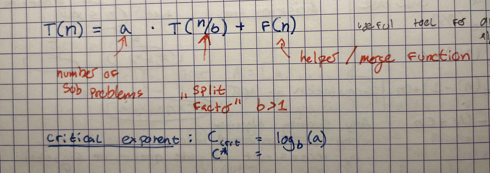

For case 1, dominated by the costs in the leaves
For case 2, the work distributed evenly in the levels , this is why its n log n for mergesort
for case 3, the work is getting polynomial smaller in the levels, then the heavy load is in the root, dominated by it

### Sketch a proof for one of the cases.
Height = $log_{b}n$
Leaves $n^{log_{b}a}$
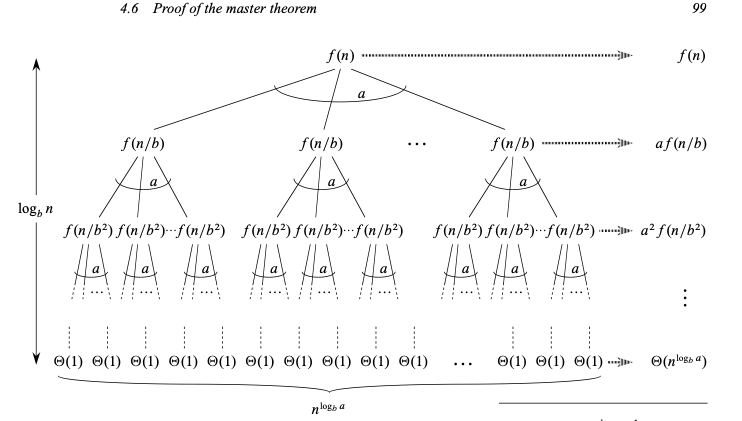
Total work = $\theta (n^{\log_{b}a} ) +\sum\limits_{j=0}^{\log_{b}n-1}a^{j}f(n/ b^j)$

**Proof for case 1**
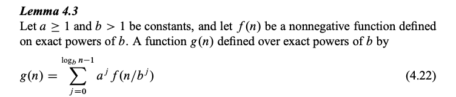
For case 1, we have $f(n)=O(n^{\log_{b}a-\epsilon})$
Which implies $f(n/b^{j})=O((n/b^{j})^{\log_{b}a-\epsilon})$
Substituting into equation (4.22) yields
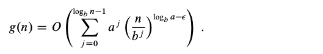
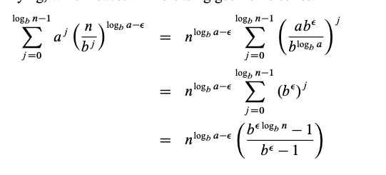
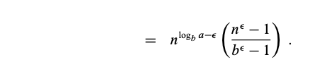
Since $b$ and $\epsilon$ are constants, we can rewrite the last expression as $n^{log_{b}a-\epsilon}O(n^{\epsilon})=O(n^{log_{b}a})$
Substituting this expression for the summation in equation (4.23) yields
$g(n)=O(n^{log_b}a)$
thereby proving case 1.
## Integer Multiplication

### What is Karatsuba’s algorithm?

Karatsuba's algorithm is a divide-and-conquer method for multiplying two integers more efficiently than the standard "grade-school" approach. $O(n^2)$
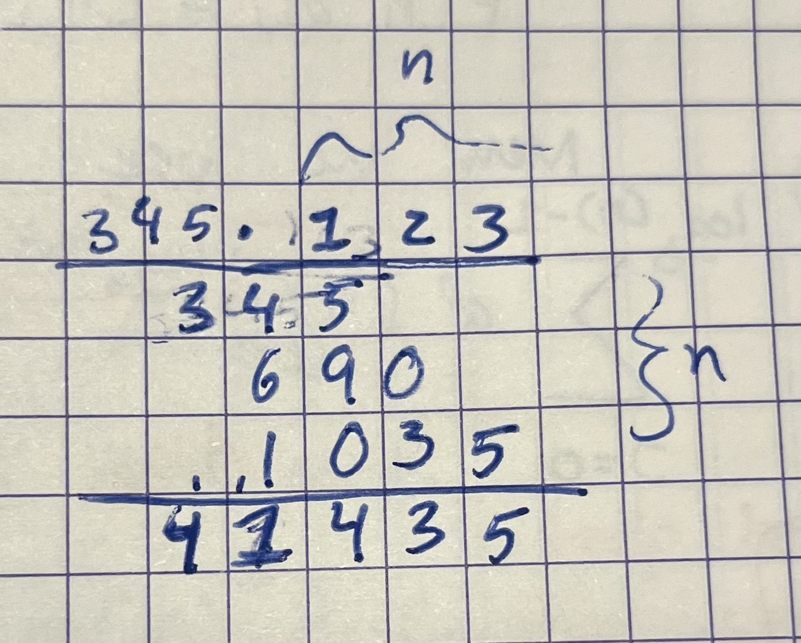
It reduces the number of multiplications required, which is the most computationally expensive operation in integer multiplication.

The trick is to get to down to **three** recursive calls, as if we do four, it will lead to $n^2$
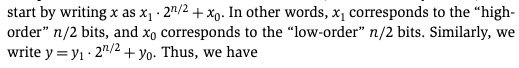

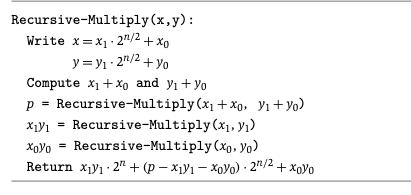

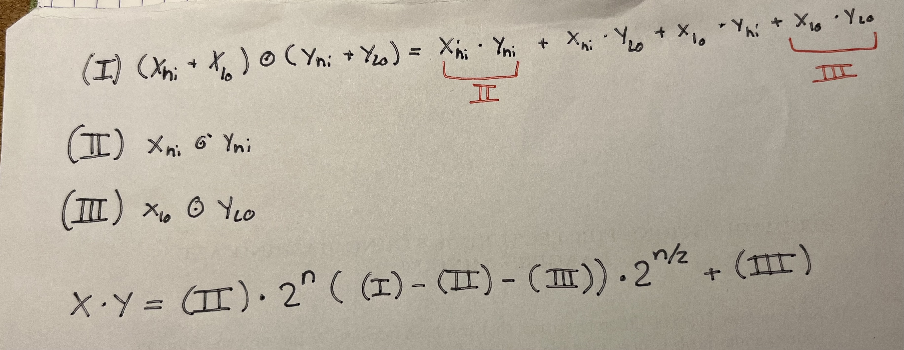
theres a plus after $2^n$  
### What is its running time?

From master thm

3 way branching, split factor of 2, because we halve the number of bits each time we branch
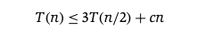
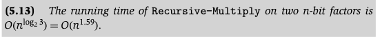
