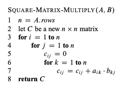
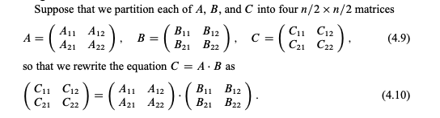
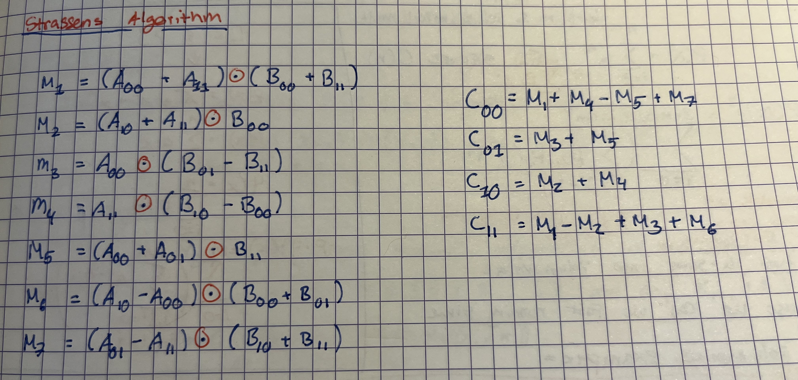
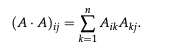

## Matrix multiplication

### Define the matrix multiplication problem. How many arithmetic operations do you need to solve this problem in the standard way?

You need

|     | A   |
| --- | --- |
| B   | C   |

$O(n^3)$

### Describe a way to reduce $𝑛 × 𝑛$ matrix multiplication recursively to 8 multiplications of $𝑛/2 × 𝑛/2$ matrices.

red dot involves multiplying matrixes of size n/2
We branch out 8 times, ie red dots
so A = 8
b = 2
$n^2$ because we need to add the matrixes together
$$T(n)= 8 \cdot T(\frac{n}{2})+O(n^2)$$
Solve with master thm
$\in \theta (n^3)$

### How many recursive multiplications does Strassen's algorithm require, and what running time does this translate to in the end? Argue for the running time bound.

Strassens requires 7

$$O(n^{log_27})=O(n^{2.8}), \text{which dominates}O(n^2)$$

### Define the constant $\omega$ . What does the existence of Strassen's algorithm imply for $\omega$ ? What are the best known lower and upper bounds on $\omega$?

> [!Def] >$\omega$ : best known exponent $n^\omega$ for matrix multiplication

Trivial: $n^3$
Strassen: $n^{2.8}$
Lowest possible bound: $n^2$, because of the input size
somebody is out on the digits $2 \leq 2.3715 \leq 2.3728$

## Matrix multiplication for cliques

### How can matrix multiplication be used for detecting and counting triangles?

We start by representing the graph trough an adjencency matrix.
When we times the matrix with it self, $A^2$

We get a contribution of one for each index $k$ where there is an edge $ik$ as well as an edge $kj$—in other words, the $(i, j)$th entry of $A^2$ counts the number of two-hop paths from $i$ to $j$
The diagonal entries $A^3[i][i]$ give three times the number of triangles involving vertex iii, as each triangle is counted once for each of its vertices.
And twice for going around one way or the other
so you divide the trace by 6

### How can the algorithm for triangles be extended to detect cliques of a given size k? How does this compare to the brute-force algorithm?
to make k divisble by three we can just add two or 1 dummy vertices. 

A clique of size $k$ is a set of $k$ vertices that are pairwise connected. Detecting or counting such cliques can be extended from the triangle-detection approach.

To solve question A, we construct a graph $G'$ where each vertex corresponds to a unique $k/3-clique$  in $G$. A vertex $u,v$ in $G'$ is connected if and only if they do not share a vertex in $G$ and the two cliques are fully connected. Finding a clique of size $K$ is therefore reduced to finding a triangle in $G'$. As a triangle in $G'$ corresponds to three different fully connected $k/3-cliques$ in $G$.

To find all $k/3-cliques$, we first find all subsets of size $k/3$, of which there are $\binom{n}{k/3}$. We can show that $\binom{n}{k/3} \in O(n^{k/3})$, since
$$\begin{equation*}
    \binom{n}{k/3} = \frac{n!}{(k/3)!(n - k/3)!} < \frac{n!}{(n - k/3)!} = n \times (n - 1) \times (n - 2)\ \cdots\ (n - (k/3) + 1) < n^{k/3}
\end{equation*}$$

Since we know that $G'$ has at most $O(n^{k/3})$ vertices, multiplying a $n^{k/3} \times n^{k/3}$ matrix to find a triangle in $G'$ would take time $O(n^{(k/3)^\omega}) = O(n^{\omega k/3})$.

 the brute force is just trying all subsets  $n^k$

### Can you use the clique algorithm to find/count independent sets

The independent set is the opposite problem of the clique.
**Key Insight**
An independent set in a graph is a set of vertices with no edges between them. A clique in the complement graph (where edges exist between non-adjacent vertices of the original graph) corresponds to an independent set in the original graph.

Find the complement graph $\overline{A} = J - I - A$ *dont know about this its from the chat*where J is the all-ones matrix and I is the identity matrix.

**Flip the matrix**

- Use the clique-detection algorithm on $\overline{A}$ to find cliques of size k in the complement graph.
- Each clique of size k in the complement graph corresponds to an independent set of size k in the original graph.
