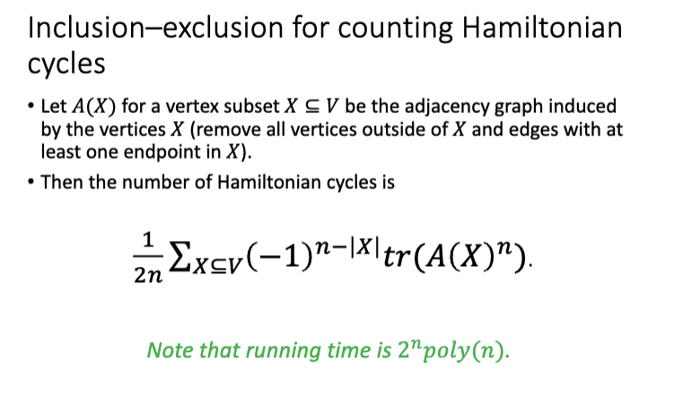
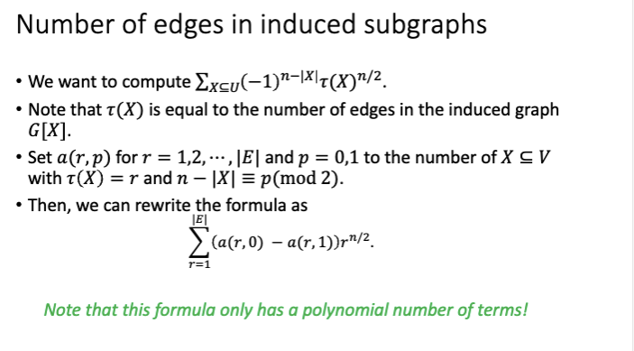

## ETH and SETH

### Explain the statement of the exponential-time hypothesis ETH and the strong exponential-time hypothesis SETH. Consider the following:

The Exponential Time Hypothesis (ETH) states that 3-SAT cannot be solved in subexponential time, specifically that it requires at least $2^{cn}$ time for some constant $c > 0,$ where $n$ is the number of variables, ie $2^{o(cn)}$, small O if n 

SETH stands for the strong exponential time hypothesis and states that there is a constant $k$ such that no algorithm can solve k-SAT on $n$ variables with clauses of width at most $k$ in time $2^{(1−\epsilon)n}.$

Informally this means that the time required to solve k-SAT increases exponentially with the number of variables.

**ETH**:  $\exists S >0$ such that 3-sat requires time $\geq 2^{sn}$

**Seth** : $\forall s >0,$ $\exists k$ s.t k-sat requires $2^{(1-s)n}$ time, k>2

#### Why do they imply $P \neq NP$?
ETH implies $P \neq NP$ because if $P = NP$, all NP problems, including 3-SAT, would be solvable in polynomial time, contradicting ETH.
#### Is an algorithm with running time $O(1.0001^{n})$ for 3-SAT possible under ETH? 
No, it is not, 
It grows slower than $2^{o(n)})$

#### Is an algorithm with running time $O(1001^{{n}/{\log n}})$ for 3-SAT possible under ETH?
mathrule $(a^m)^{n}=a^{mn}$
No. We can simplify this to: $$ 1001^{n/\log n} = 2^{\log_2(1001) \cdot (n/\log(n))} = 2^{O(n/\log(n))} $$
This is subexponential time since $O(n/log⁡(n))=o(n)$ and thus $2^{O(n/log⁡(n)}=2^{o(n)}$. ETH rules out subexponential time algorithms for 3-SAT, so this is not possible.
#### Are either of these algorithms possible under SETH?

Since seth is stronger then these runtimes are not allowed 

#### Briefly give two examples for concrete super-polynomial running times for 3-SAT that are ruled out under ETH.
1. $O(2^{n/100})$ this is super-polynomial but sub-exponential time complexity.
2. $O(1.999^n)$ this is super-polynomial but sub-exponential time complexity.
### What is the sparsification lemma, and why is it useful?
The sparsification lemma states that any CNF formula $\phi$ with $n$ variables and $m$ clauses can be written as a disjunction of $O(2^{\epsilon n})$ CNF formulas, each with $O(n / \epsilon)$ clauses, for any $\epsilon > 0$

In simpler terms, the lemma allows us to "sparsify" a dense kk-SAT formula into a collection of smaller, sparse formulas without significantly increasing the overall complexity of the problem.

This should all take $2^{\epsilon n} \cdot \text{poly}(n)$ time.
### Describe the Orthogonal Vectors problem.
Given two sets L and R of n size vectors from $\{0,1\}^d$ with $d=poly \log(n$), the problem is to determine if there is a pair of vectors $u∈L$ and $v∈R$ such that $u⋅v=0$. This generally takes $O(n^2)$ time to chech

#### Which lower bound does SETH yield for this problem? Sketch the lower bound.

We can then reduce the problem to diameter. Diameter in a connected undirected graph is the smallest positive integer k such that every vertex has a path to each other vertex of length at most k

#### Is an $O(n^{2}/\log n)$ algorithm or an $O(n^{2} / \sqrt{n})$ time algorithm possible under SETH?

**$O(n^2/log_{2}n)$**

no, since n^2 is smaller than seth

**$O(n^2/n^{1/2})$**

no since no are polynomials run times 
### Describe the k-Dominating Set problem. 
A dominating set in an undirected graph is a subset of the vertices such that every vertex is either connected to a vertex in S or is in S itself. A k-dominating set, is a dominating set of size exactly k.

#### Which lower bound does SETH yield for this problem? Sketch the lower bound

## Inclusion/Exclusion

### State and explain the inclusion-exclusion principle.

Essentially we add the sizes of the sets, then subtract the sizes of the intersections of the sets, then add the size of the intersection of all sets, this is because we've removed that size twice.

The sum has $2^{n−1}$ terms, so it's not practical to compute by hand.
### Describe how to solve the Hamiltonian cycle problem using inclusion-exclusion.
The Hamiltonian cycle problem is the problem of determining whether a given graph contains a Hamiltonian cycle. 
A Hamiltonian cycle is a cycle that visits every vertex exactly once. This problem is NP-hard.
#### Describe the role of walks and paths.
A walk is the loosest of the two, it is just a sequence of vertices. It can be open or closed, closed then we have that $V_{1}= V_{k+1}$
A path is a walk, but the sequence has distinct vertices. 

A closed n-walk is a Hamiltonian cycle if all vertices except the first and the last are unique. Removing the last vertex would make it a n-path
#### How can you count walks in polynomial time?
First define the graph as an $n×n$ adjacency matrix $A$ where $A_{ij}=1$ if there is an edge between i and j, and 0 otherwise.

calculate $A^k$ then the entry at $u,u$ equals the number of closed k-walks starting and ending in $u$. Or open walks from between $v,u$

The trace of a matrix is the sum of its diagonal entries. Hence, $𝑡𝑟(𝐴^n)$ computes a weighted sum of the number of closed n-walks.

 The Hamiltonian cycles are counted 2𝑛 times each, once per vertex and direction.

Using matrix multiplication and fast exponentiation we can calculate this in polynomial time.
#### Why do you need to count them, and why is deciding existence not enough?
The inclusion-exclusion principle requires us to count the number of structures (e.g., closed walks) that satisfy certain conditions. By counting walks, we can systematically account for all possible ways to form a Hamiltonian cycle.

The inclusion-exclusion principle relies on exact counts to compute the number of valid Hamiltonian cycles. 

We can simplify the description of the algorithm to:

1. Count all closed walks of length n in the graph.
2. Subtract the number of closed walks that miss at least one vertex.
3. Add the number of closed walks that miss at least two vertices, to correct over subtraction.
4. Continue this alternating inclusion-exclusion process until all cases are accounted for
We can say that $X$ is the number of vertices that are not excluded in the walk.
#### Briefly compare this approach to the Bellman-Held-Karp dynamic programming algorithm for Hamiltonian cycles. Also outline the DP algorithm.
==TODO understand==
The Bellman-Held-Karp dynamic programming algorithm is an algorithm for computing the Hamiltonian cycle in a graph. It works as follows:

- For each subset $S$ of vertices and a vertex $v∈S$, let d$p[S][v]$ represent the number of paths that start at a fixed vertex, visit all vertices in $S$ exactly once and end at $v$.
- The base case is $dp[v][v]=1$ for the starting vertex $v$.
- For each subset S and vertex v, compute $dp[S][v]$ by iterating over all predecessors $u$ of $v$ in S: $$ dp[S][v] = \sum_{u\in S, u\neq v}dp[S\setminus {v}][u] \cdot A_{uv} $$
- Finally the number of Hamiltonian cycles is the sum of $dp[V][v]$ for all $v$ adjacent to the starting vertex.

The dynamic programming algorithm is a bottom-up approach that builds up the solution incrementally by considering all possible paths and vertices. It is a more direct and efficient way to compute the Hamiltonian cycle compared to the inclusion-exclusion method, which relies on the principle of inclusion-exclusion to count the number of Hamiltonian cycles.

The time complexity is $O(n^{2} \cdot 2^{n}$). This is essentially combinatorial vs implementation.

### Describe how to count perfect matchings in a graph using inclusion-exclusion. Which structures are counted in the individual terms of the inclusion-exclusion formula?
A perfect matching in a graph is a set of edges such that every vertex is incident to exactly one edge.

Finding a perfect matching is a polynomial time problem, but counting them is NP-hard.

A perfect matching in an 𝑛-vertex undirected graph 𝐺 = 𝑉, 𝐸 is a set of $𝑛/2$-vertex-disjoint edges.

We can solve this problem with set partitioning

inclusion–exclusion algorithm for Set Partition with equal sized sets
From set partioning we have that we can count the number of perfect matchings in a graph $G=(V,E)$ as:

- Let the family $F$ the the edges $E$ of the graph and set $k=n/2$.
- Let $t(X)=|f:f∈F,f⊆X| \text{ for } X⊆V.$
- Then the number of perfect matchings is: $$ \sum_{X\subseteq U}(-1)^{n-|X|}t(X)^{n/2} $$
This counts the perfect-matchings with multiplicity $n/2$ and runs in $O(2^n|E|n)$ time with $O(nlog⁡(|E|))$ space.

The vanilla inclusion–exclusion method 
We get a $2^{n}poly (n)$ time and polynomial space algorithm for counting the perfect matchings in a general 𝑛-vertex graph
##### But we can do better
Number of edges in induces subgraphs
==TODO yikes==

#### How can you speed this up on bipartite graphs, and what are the structures counted there?

The permanent of a 0/1 square matrix is the number of perfect matchings in a bipartite graph. The permanent can by Ryser's algorithm be computes as: $$ per(A)=\sum_{X\subseteq[n]}(-1)^{n-|X|}\prod_{i=1}^n\left(\sum_{j\in X}A_{ij}\right) $$

The permanent differs from the determinant by not accounting for the sign of the permutation.

Calculating the permanent takes $O(2^{n}n^{2})$ time but $n$ is now only half the size of the original graph.
### Consider an n-vertex graph G.
#### How is the chromatic number of G defined?

- A graph with chromatic number 1 has no edges as all vertices can be colored the same.
- A graph with chromatic number 2 is bipartite.
- A graph with chromatic number n is complete.
#### How can you compute the chromatic $O(3^{n})$ number in time? The approach we’ve studied reduces the problem to counting certain structures. What are these structures and how fast can you count them?

- Every colorclass is an independent set in the graph. 
- Let the ground set 𝑈 be the set of vertices 𝑉. 
- Let the family ℱ be the independent sets in the graph. 
- To see if 𝑘 colors are enough, we want to see if 𝑈 can be covered by 𝑘 independent sets. 
- The smallest such 𝑘 is the chromatic number
We can do the calculation via induced subgraphs. First define $t(X)$ for a subset $X⊆V$ as the number of independent sets in the induced graph $G[X]$, then:

