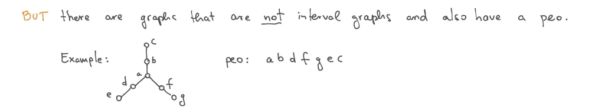
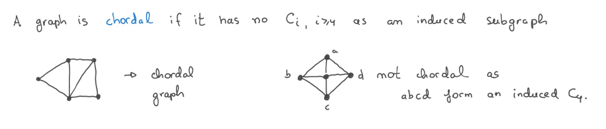
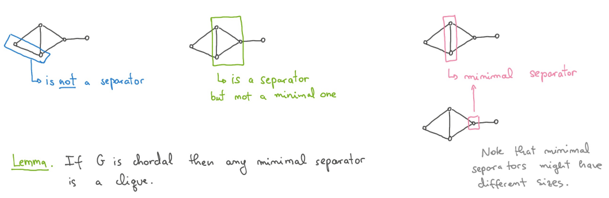
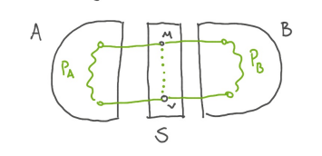
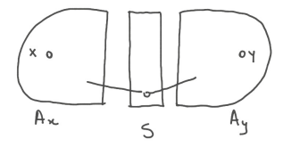
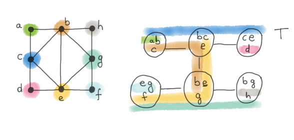
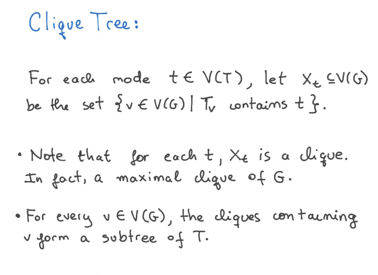

# Chordal graphs

### What is a chordal graph and what is an interval graph?

**Chordal graph**, example, where all cycles can be broken down into cycles of 3. There has to be a chord in the cycle if it is a above 3.
**Interval graph**
An interval graph is a graph that has an interval model and it is a type of chordal graph.
As it cannot have cycles with no chord.
As we can see in example of C4. Drawing

### Show that every interval graph is a chordal graph.

Well in particicluar, this is shown by the cycle constraint. If we have a a C4. We cannot order them linearly, as we would like to when we have a interval graph. This introduces thee needs for chords, thus making it a chordal graph.

- [ ] ==TODO: Would be good with drawing==

### Show that a graph is chordal if and only if it has a perfect elimination ordering.

A perfect elimnation ordering is an ordering of the interval or chordal graph that,

> [!DEF]
> A perfect elimination ordering is an ordering of $V(G)$ $V_{1}V_{2}V_3...V_{n}$ s.t
> the neighbors of $V_i$ in $G[{V_{1},V_{2},V_3,...,V_{i-1}}]$ form a clique.
> $G[{V_{1,}V_{2},V_3,...,V_{i-1}}]$ : subgraph of G indueces by the set ${V_{1},V_{2},V_3,...,V_{i-1}}$

Inteval graphs have a PEO, but some non interval graphs also have a peo.

> [!DEF] > **N(V)**: Set of vertices adjacent to V, neighbourhood
> **Simplicial vertex**: If N(v) is a clique in G. Then v is a simplicial vertex

##### non interval with peo

##### continue

**Observation 1** : With the peo defined we can make the observation that, the cycle graph $CI$ for i larger than 4, does not a peo, because CI does not have any simplicial vertcies
**Observation2**: If a graph has Ci as an induced subgraph, then it does not have a peo.
proof with Íwith drawing

####

#### Chordal graph <= peo

In oberservation 2 we show that if G is not chordal then it does not have a peo.

#### Chordal => peo

- Let $G$ be a chordal graph. We want to show that G has a peo.
- Note that for any vertices v, G-v is till chordal, as the removal of a vertex does not create any new cycles.
- If g is chordal then it has atleast one simplicial vertex, and we can remove these vertices one by one, from G to obtain a perfect eliminiation ordering.

- If G is a complete graph, then it has a simplicial vertex (a graph in which each vertex is connected to every other vertex)

- If G is not a complete graph. Then G has two non-adjacent simplicial vertices. We need: - A seperator in Graph G is a set $S \subseteq V(G)$ such that $G-S$ is disconnedted - A seperator is minimal if no subset of S has the same property - 
  **Proof** for the **lemma**
  > [!Lemma]
  > If G is chordal then any minimal seperator is a clique.

Let S be a minimal separator of G and suppose by a contradiction that S is not a clique, That is $\exists u,v \in S$ st. $uv \notin E(G)$
By the minimality of S there exists two connected components $A,B$ of $G-S$ s.t every vertex of S has a neighbor in A and a neighbor in B
S is a seperator => there are no edges between A and B
Since A is a connected component and both u and v have a neighbor in A, $A \cup {u,v}$ is also connected
 - Let $P_a$ be the shortest path between u and v in $G[{A\cup \{u,v\}}]$. - Let $P_b$ be a shortest u,v path defined anlogously in $G[{B\cup \{u,v\}}]$ - Then since P_A has atleast one vertex in A and PB has at least one vertex in B then we conclude G has an induced cycle on at least 4 vertices.
==UNDERSTANDED! because m and v are missing a edge, they are therefore missing a chord

> [!Lemma]
> If $G$ is chordal and is not a clique then G has at least two non-adjacent simplicial vertices

**Proof**
We prove by induction on the number of vertices.
If G is not complete, G has at least three vertices. If G is a 3 vertices line (smallest non complete graph), then g has two non adjacent simplicial vertices.

- Let G be a chordal graph that is not complete.
  - Then $\exists x,y \in V(G)$ s.t $xy \notin E(G)$
- Let S be a minimal separator that separates x and y
- let A_x be the connected component of G-s that contains X and let A_y be defined accordingly.
- 
  - Note that $G[A_{x}\cup S]$ is chordal . If $G[A_{x}\cup S]$ is complete, then $A*x$ contain a simplicial vertex which is also a simplicial vertex in G. By induction hypothesis, $G[A*{x}\cup S]$ has two non-adjacent simplicial vertices.
- note that a vertex that is simplicial in $G[A_{x}\cup S]$ but is contained in S is _not_ necesarily simplicial in G, as this vertex has neighboors in $A*y$.
  However since $G[A*{x}\cup S]$ has two non-adjacent simplicial vertices and by Obs2 S is a clique we know that at least one of the simplical vertices is in Ax, (and not in S) . Hence this vertex is also a simplicial in G. (Note that is has the same set of neighbors in $G[A_{x}\cup S]$ and in $G$
  With a symetric argument we find a simplicial vertex in $A_Y$ since S is a seperator, there are no edges between Ay and Ax. Hence we have found two-non adjacent simplicial in G as desired

By the main thm we conclude that GRAPH coloruong can be solved in poly time on chordal graphs.

### Give a polynomial time algorithm to solve the Graph Coloring problem on chordal graphs. Argue for the correctness of the algorithm. What is the running time?

**Step 1: Find a Perfect Elimination Order (PEO)**
	Use a linear-time algorithm
**Step 2: Greedy Coloring**
1. Process the vertices in the reverse of the PEO ($v_n, v_{n-1}, \ldots, v_1$)
2. Assign each vertex the smallest available color not used by its already-colored neighbors.
#### Correctness of the Algorithm

1. **Chordal Graph Property**:
    
    - The PEO ensures that when a vertex $v_i$​ is being colored, its neighbors that have already been processed form a clique.
    - Thus, the number of colors used is at most $\Delta+1$, where $\Delta$ is the maximum degree of the graph.
2. **Greedy Coloring Correctness**:
    
    - The greedy algorithm ensures that no two adjacent vertices have the same color.
    - Since the PEO ensures a minimal clique structure, the greedy algorithm produces an optimal coloring for the graph
#### Running Time

1. **Finding the PEO**:
    - PEO takes $O(V+E)$, where $V$ is the number of vertices and $E$ is the number of edges.
2. **Greedy Coloring**:
    - Each vertex checks the colors of its neighbors, which takes $O(E)$ across all vertices.

**Total Running Time**: $O(V + E)$
### What is a clique tree for a chordal graph? Show how to construct a clique tree for a chordal graph in polynomial time.

A clique tree for a chordal graphs shows us the maximal sizes of the cliques, and the denotes for us some seperators.
We can construct these in polynomial time.

PEO

# Solving problems on chordal graphs

### Describe how to solve the Maximum Independent Set problem on trees. How can you solve it on forests?
Trees are good for dynamic programming. 

we know that once we have seen a vertex we will not see it again, else there would be a cycle.

**Step 1.** Pick a root
**Step 2** Define a dp relation
	- Define $DP(u, 0)$ as the size of the largest independent set in the subtree rooted at $u$, excluding $u$.
	- Define $DP(u,1)$ as the size of the largest independent set in the subtree rooted at $u$, including $u$
The recurrence relations are:

$DP(u, 0) = \sum_{v \in \text{children}(u)} \max(DP(v, 0), DP(v, 1))$

$DP(u, 1) = 1 + \sum_{v \in \text{children}(u)} DP(v, 0)$

The result for the root is:
$\max(DP(\text{root}, 0), DP(\text{root}, 1))$

#### Forests
A forest is a disjoint union of trees. Solve the DP relation on each tree separately (using the tree algorithm above) and sum the results.
### What is a nice clique tree?
A **nice clique tree** is a structured representation of a chordal graph:

1. Every maximal clique in the graph is represented as a node in the tree.
2. Each vertex in the graph appears in a connected subset of the tree (the **running intersection property**).
It is made with the idea of a clique tree, 
But has distinct rules for nodes
- Introduce nodes
- Forget nodes
- Join nodes
- Leafs

The number of nodes is still polynomial in $n$

### Describe the Feedback Vertex Set problem. Give a polynomial time algorithm to solve this problem on chordal graphs using a nice clique tree. What is the running time of the algorithm?
Now for the Feedback Vertex Set problem, which asks us to find a minimum set of vertices whose removal makes the graph acyclic (i.e., turns it into a forest), maximal forest

For any bag in the nice clique tree we have that the size of the maximum induced forest it at most 2. 

This is due to the nature of a clique tree as every bag is fully connected, so any subset of a bag larger than 3 would produce a cycle and can therefore not be a tree. 
To compute the maximum induced forest of $G$, we define a bottom-up DP relation on the nice clique tree of $G$.

First, define $B_t$ as the bag of vertices of tree node $t$, and $S$ as a subset of $B_t$ such that $S \subseteq B_t \leq 2$. We want to use compute all subsets $S$ to look up the DP relation of the children nodes, to compute the intersection of exactly the nodes in $S$.

**Leaf node:**
The leaf node leaves a pretty simple DP relation as it is always empty. 
$$
DP[t,\emptyset] = 0
$$
**Introduce node:**
The introduce needs to handle both what the child node $t'$ contains as well as the introduce node $t$. Let $v$ be the node introduced in the bag $t$. By the definition of the introduction bag, we can only intersect in $t'$ with subsets that do not include $v$. Therefore, when we want to calculate the DP relation with subsets including $v$, we add 1. 

$$\begin{equation*}
    DP[t, s] = \begin{cases}
        DP[t', S \setminus \{v\}] + 1   & a \in S \\
        DP[t', S]                       & a \notin S
    \end{cases}
\end{equation*}$$

**Forget node**
We define $v$ as the vertex forgotten in bag $t$, and denote $t'$ as the child of $t$, which contains $v$. For each subset, check whether we get a better result when we include the forgotten vertex or when we decide to forget it. 
$$\begin{align*}
DP[t,S] = \max(DP[t', S], DP[t', S \cup \{v\}])
\end{align*}$$

**Join node:**
For the join node, we want to combine the results of the two children, but without doubly counting the subset we are looking up. Let $t_1$ and $t_2$ define the children of $t$.
$$\begin{align*}
DP[t, S] =& DP[t_1, S] + DP[t_2, S] - |S|\\
\end{align*}$$

**Runtime**
Constructing the nice clique tree takes $O(n^2)$ time. 
There are at most $\sum_{k = 0}^2 \binom{n}{k} \in O(n^2)$ subsets with size at most 2 in a bag of $n$ vertices, since $\binom{n}{2} \in O(n^2)$, and $\binom{n}{1} + \binom{n}{0} = n + 1$.
Hence, we can use dynamic programming on a nice clique tree in $O(n^2 \cdot n^2) = O(n^4)$ time to solve the *Minimum Feedback Vertex Set* on chordal graphs.