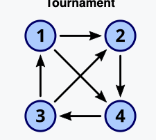

## Basics and Branching

### What is a parameterised problem?

A paramitized problem is a problem with an additional input typically. For example in the vertex cover, we give the input and a k, where k is the size of the cover we want to find.

### What is an FPT algorithm?

An FPT, fixed parameter tractable, algo that solves a problem in time
$f(k) \cdot n^{c}$
$$F(k) \cdot poly(|I|)$$
Where f(k) is function only dependent on k
poly in input size
FPT algorithms are considered efficient for small values of k because the dependence on $k$ is separated from the input size, and the running time is polynomial in $|I|$ for a fixed $k$.

We have also learned about XP - slice wise polynomial
XP runtime = $f(k)\cdot n^{g(k)}$

### For which parameter choices does an FPT algorithm run in polynomial time?

An FPT algorithm runs in polynomial time when the parameter k is bounded by a constant. In such cases, the function f(k) becomes a constant multiplier, and the overall running time simplifies to, poly(I) which is polynomial.

### Describe how to solve the Vertex Cover problem in running time, where $k$ is the$𝑂(2^{𝑘}𝑛)$ solution size.

The Vertex Cover problem states that given a graph $G=(V,E)$ and a parameter integer $k$, determine whether there exists a subset of vertices $S⊆V$ of size at most $k$ such that every edge in $E$ is incident to at least one vertex in $S$.

Every edge has to be in the cover, so we can for each edge either pick $u$ or $v$

- Let $G=(V,E)$ be the input graph and $k≥0$ be the parameter.
- Check the base cases:
    - If $k=0$, return True if $E=∅$ and False otherwise.
    - If $E=∅$, return True.
    - If $k<0$ return False, the vertex cover doesn't exist
- Recursive case while $k>0$:
    - Pick an edge $(u,v)∈E$. (For the vertex cover to exist either $u$ or $v$ must be in it)
    - Branch on two cases:
        - Include $u$ in the vertex cover and recursively solve the problem on $G−u$ with $k−1$.
        - Include $v$ in the vertex cover and recursively solve the problem on $G−v$ with $k−1$.
    - If any of the branches return True, return True, otherwise return False.

We can quickly see that the algorithm branches on 2 cases and that the depth of the recursion is at most $k$, therefore there must be at most $2^k$ leaves in the search tree. At each node in the search tree, we spend, in the worst case, $O(n)$ time to remove a vertex and it's edges. Thus the running time of the algorithm is $O(2^kn)$.
#### Better vertex cover from book with ridiculous running time
**Observations** 
- For a vertex v, any vertex cover must contain either v or all of its neighbors N(v)
- Vertex Cover becomes trivial (in particular, can be solved optimally in polynomial time) when the maximum degree of a graph is at most 1.

Given an instance $(G,k)$, we first find a vertex $v ∈V(G)$ of maximum degree in $G$. If $v$ is of degree 1, then every connected component of G is an isolated vertex or an edge, and the instance has a trivial solution

 Otherwise, $|N(v)|≥2$ and we recursively branch on two cases by considering
 - either $v$, or $N(v)$ in the vertex cover.

### How can you improve the running time of the above algorithm?
Kernelization, we can change the input size and filter out no-instances.

**Rule 1:**
- if G has a vertex $v$ with $d(v)\geq k+1$ then $G-v,k-1$ is an equivalent instance for vertex cover
		(G,k) is a yes instance for VC $\Leftrightarrow$ $G-v,k-1$ is yes instance for VC
**Rule 2:**
- if G has a vertex v with degree 0 then $(G-v,k)$ is an equivalent instance

Apply both rules until they are no longer applicable and get $(G',k')$

*If* $|V(G')| \geq k^{2}+k$
	return no instance
*Otherwise* 
	return $(G',k')$
			
So now the runnig time goes from $O(2^kn)$ to $O(2^{k}\cdot (k^{2}+k))$
#### Why does this work
If $(G,k)$ is a yes instance then $|V(G')| \leq k^{2}+k$
Lets imagine the vertex cover in a box with covered edges going out it. There are at most k vertices in the box.
Because of rule 2, vertices have connection to the outside of the box.
there are $k$ inside the box,and at most $k\cdot k$ outside the box.
Rule one removes vertices that have more kan k vertices. 

> [!Theorem 2.4.] 
> Vertex Cover admits a kernel with $O(k^2)$ vertices and $O(k^2)$ edges.


#### Book approach
The book talks about looking at the neighborhood of v instead of the individual edges.
### How can we solve Independent Set on 3-regular graphs in time $𝑂(4^{𝑘}𝑛)$ ?
The Independent Set problem is the problem of finding the largest possible set of vertices in a graph such that no two vertices are adjacent. The problem is NP-hard in general, but we can solve it on 3-regular graphs in time $O(4^kn)$ using a bounded search tree.

Let G be the input 
For any vertex in the graph $v$ branch
- Let $G=(V,E)$ be the input graph and k≥0 be the parameter.
- Check the base cases:
    - If $k≤0$ return True, a set of size 0 is always independent.
    - If $|V|=0$ return True if $k=0$ and False otherwise.
- Recursive case while $k>0$:
    - Pick a vertex $v∈V$ of degree at most 3.
    - Branch on at most four cases for each vertex $u_1,u_2,u_{3}∈N(v)$:
        - Include v in the independent set and compute $G´$  by removing $v$ and $N(v)$ from G. Recursively solve the problem on $G′$ with $k−1$.
        - Include $u_1$ in the independent set and compute G′ by removing $u_1$ and $N(u_1)$ from G. Recursively solve the problem on G′ with k−1.
        - Include $u_2$ in the independent set and compute G′ by removing $u_2$ and $N(u_2)$ from G. Recursively solve the problem on G′ with k−1.
        - Include $u_3$ in the independent set and compute G′ by removing $u_3$ and $N(u_3)$ from G. Recursively solve the problem on G′ with k−1.
    - If any of the branches return True, 
	    - return True, 
	- otherwise return False.

In each branch we remove at most 4 vertices, and we do this at most $k$ times. This leaves $4^k$ leaves in the search tree. At each leaf we've removed at most $n$ vertices, therefore the running time is $O(4^{k}n)$.

### Define a tournament. How can we solve Feedback Vertex Set on Tournaments in time $O(3^{k}n^{3})$?
A tournament graph is a complete graph with orientation.

Feedback vertex set: Does T have a set S on k vertices such that T-S has no directed cycles.b

For tournements we have that If T has a directed cycle then it has a directed triangle
Therefore we can branch on factor 3.
Depth is at most k

```
(T,k)
- (T-v_1, k-1)
- (T-v_4, k-1)
- (T-v_3, k-1)
```
Solving this gives a max amount of leaves of $O(3^k)$ but we must keep in mind that finding a cycle (triangle) in a graph takes $O(n^3)$ time using a brute-force algorithm, therefore the running time is $O(3^kn^3)$.
## Kernelization

### What is a kernel for a parameterized problem?
A **kernel** for a parameterized problem is a polynomial-time preprocessing algorithm that reduces the input instance $(I,k)$ to an equivalent instance $(I',k')$, called the **kernel**, such that:

- $|I'| \leq g(k)$ for some function $g$, where $g(k)$ is typically polynomial or exponential in $k$.
- $k' \leq k$.
- $(I, k)$ is a yes-instance if and only if $(I',k')$ is a yes-instance.

### Argue that a parameterized problem has a kernel if and only if it is FPT
if a problem is FPT then the algo has runtime of $f(k)\cdot poly(i)$ . 
#### First, kernel $\Leftarrow$  fpt
Example with Vertex cover which is FTP by $k$ -> $2^{k}\cdot n$
If we have this we can create a dumb kernel that does this 

If $|V(G)|\geq 2^k$:  
	run FTP algo : 
		$2^{k}\cdot n \leq n^{2}$
		Which is essentially:
		$f(k)\cdot poly(n)\leq n\cdot poly(n)$
	Output equivalent  trivial answer	(o-o,k=1)-> yes          (o-o,k=0)->no
	
Otherwise, $|V(G)|< 2^k$ : output (G,k)

This can be generalized
#### then, kernel $\Rightarrow$  fpt
If the parameterized problem has a kernel, then we have successfully shrunk the input size to 
$|I'|=f(k)$

We should very well we able to keep in the runtime of ftp ($f(k)\cdot poly(n)$)
proof lmao aint the best
==TODO, not sure about this==:

> [!!] But you can have a FPT algorithm without an polynmial kernel

### What is a polynomial kernel?
it is a kernelization algorithm that produces an answer, that has a solution size that is bounded by $poly(k)$
A kernel is called a **polynomial kernel** if the size of the reduced instance $|I|$ is bounded by a polynomial function of $k$, i.e., $|I'| = O(k^c)$ for some constant $c$.

### Give a kernel for Vertex Cover parameterized by the solution size $k$ with vertices $𝑂(𝑘^2)$

**Rule 1:**
- if G has a vertex $v$ with $d(v)\geq k+1$ then $G-v,k-1$ is an equivalent instance for vertex cover
		(G,k) is a yes instance for VC $\Leftrightarrow$ $G-v,k-1$ is yes instance for VC
**Rule 2:**
- if G has a vertex v with degree 0 then $(G-v,k)$ is an equivalent instance

Apply both rules until they are no longer applicable and get $(G',k')$

*If* $|V(G')| \geq k^{2}+k$
	return no instance
*Otherwise* 
	return $(G',k')$
			
#### Why does this work
If $(G,k)$ is a yes instance then $|V(G')| \leq k^{2}+k$
Lets imagine the vertex cover in a box with covered edges going out it. There are at most k vertices in the box.
Because of rule 2, vertices have connection to the outside of the box.
there are $k$ inside the box, and at most $k\cdot k$ outside the box.
Rule one removes vertices that have more kan k vertices. 

> [!Theorem 2.4.] 
> Vertex Cover admits a kernel with $O(k^2)$ vertices and $O(k^2)$ edges.
### Define the Edge Clique Cover problem. Give a kernel for Edge Clique Cover parameterized by the solution size k. Is this a polynomial kernel?
This is not a polynomial kernel
Input: G,k
Q: is there a set of $k$ cliques $\{C_{1},...,C_{k}\}$ such that 
- Every $C_i$ is a subgraph of G
- every edge is in at least of one the cliques

**Reduction 1**. 
	Remove isolated vertices
**Reduction 2.** 
	If there is an isolated edge $uv$ (a connected component that is just an edge), delete it and decrease $k$ by $1$. The new instance is $(G−{u,v},k−1)$.
**Reduction .3**. 
	If there is an edge $uv$ whose endpoints have exactly the same closed neighbourhood, that is, $N[u] = N[v]$, then delete $v$. The new instance is $(G−v,k)$
	
If G is yes instance and rules 1,2,3 can no longer be applied then
	$|V(G)|\leq 2^{k}$

	This is exponential in size and therefore it is not a polymial kernel.

#### Why is it bounded like this 
Proof. 
For the sake of contradiction, assume neither **reduction 1** nor **reduction 3** are applicable,

$|V | > 2^k$ , and G has an edge clique cover C of size at most $k$. 

Since $2^C$ (the set of all subsets of C) has size at most $2^k$ , and every vertex belongs to at least one clique in $C$ by (Isolated(1)), we have that there exists two vertices $u, v ∈ V$ such that $\{S ∈ C : u ∈ S\} = \{S ∈ C : v ∈ S\}$. 
But then

contradicting that (Twin(3)) is not applicable.

## Treewidth

### Define the treewidth of a graph. Give examples for graph families with small and large treewidth (without proofs). Sketch the tree-decomposition for a grid.

Cliques = large 
Trees = 1

### What is a nice tree-decomposition? Why is it useful?

### Describe how to solve the Maximum Independent Set problem on graphs of bounded treewidth.

#### What running time do you achieve?

#### Describe what information you store and how it is computed at the nodes of the tree-decomposition from previously computed information.

#### How to use this to conclude Vertex Cover is FPT parameterized by treewidth?

### Describe how to solve the 3-coloring problem on graphs of bounded treewidth.

### Describe how to solve the MaxCut problem on graphs of bounded treewidth.

### Describe the idea of a win-win approach to design parameterized algorithms.

### What does it mean that H is a minor of G? What does the Excluded Grid Minor Theorem say? How is it helpful to the win-win approach?

### What does the Planar Excluded Grid Minor Theorem say? 
#### How is it helpful to design subexponential parameterized algorithms on planar graphs? (Recall, in this case subexponential algorithms are those with running time $2^{O(\sqrt{k})}n^{(1)}$ where k is the solution size.

### How can we solve Vertex Cover and k-Path in time $2^{O(\sqrt{k})}$ on planar graphs?

## Color-coding

### Describe the “color-coding” algorithm for deciding whether a graph has a path of length k.

Make sure to explain the role of random colorings and walks. What changes if you want to decide the existence of cycles rather than paths?

### How can you determine the existence of a colorful k-path in a vertex-colored graph in time $(k+1)!\cdot n^{O(1)}$ or $2^{k}n^{O(1)}$? (For the second running time, modify the DP for Hamiltonian paths.)
