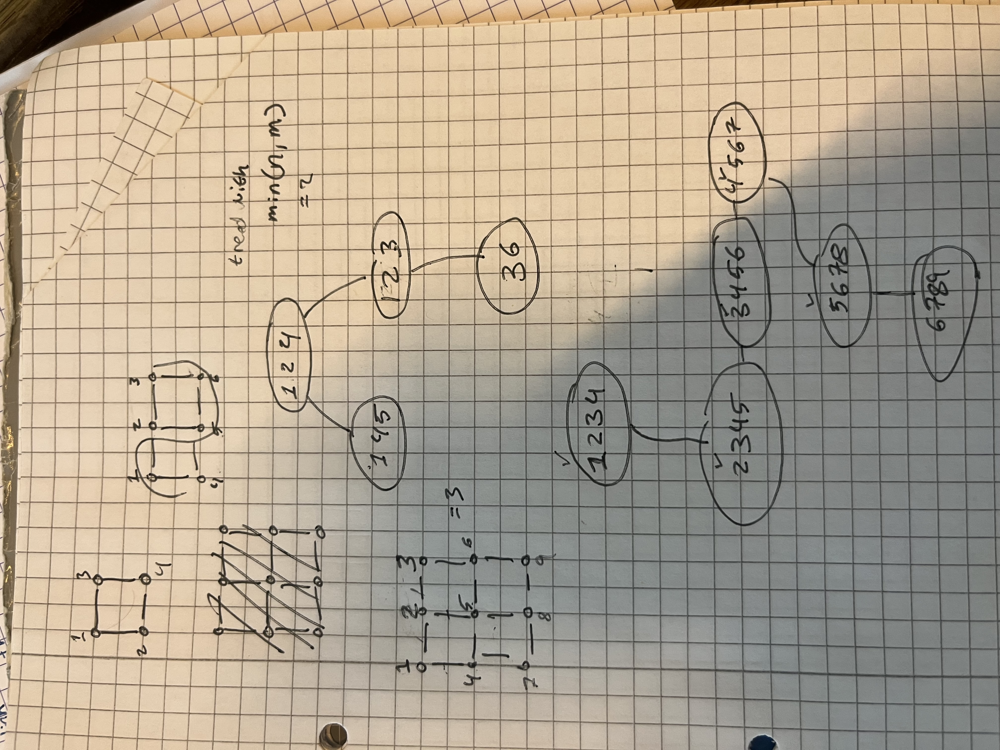
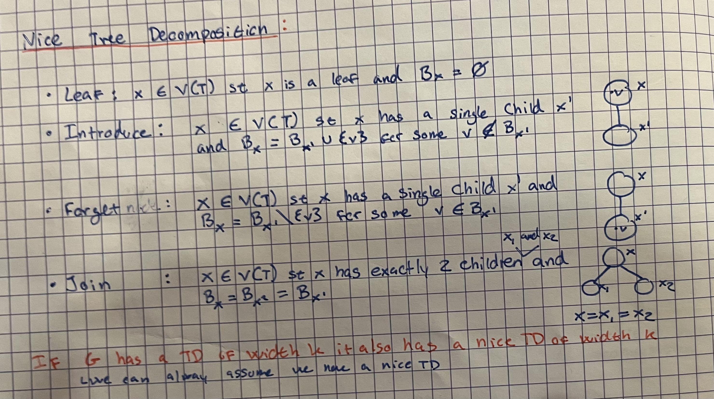

## Basics and Branching

### What is a parameterised problem?

A paramitized problem is a problem with an additional input typically. For example in the vertex cover, we give the input and a k, where k is the size of the cover we want to find.

### What is an FPT algorithm?

An FPT, fixed parameter tractable, algo that solves a problem in time
$f(k) \cdot n^{c}$
$$F(k) \cdot poly(|I|)$$
Where f(k) is function only dependent on k
poly in input size
FPT algorithms are considered efficient for small values of k because the dependence on $k$ is separated from the input size, and the running time is polynomial in $|I|$ for a fixed $k$.

We have also learned about XP - slice wise polynomial
XP runtime = $f(k)\cdot n^{g(k)}$

### For which parameter choices does an FPT algorithm run in polynomial time?

An FPT algorithm runs in polynomial time when the parameter k is bounded by a constant. In such cases, the function f(k) becomes a constant multiplier, and the overall running time simplifies to, poly(I) which is polynomial.

### Describe how to solve the Vertex Cover problem in running time, where $k$ is the$𝑂(2^{𝑘}𝑛)$ solution size.

The Vertex Cover problem states that given a graph $G=(V,E)$ and a parameter integer $k$, determine whether there exists a subset of vertices $S⊆V$ of size at most $k$ such that every edge in $E$ is incident to at least one vertex in $S$.

Every edge has to be in the cover, so we can for each edge either pick $u$ or $v$

- Let $G=(V,E)$ be the input graph and $k≥0$ be the parameter.
- Check the base cases:
    - If $k=0$, return True if $E=∅$ and False otherwise.
    - If $E=∅$, return True.
    - If $k<0$ return False, the vertex cover doesn't exist
- Recursive case while $k>0$:
    - Pick an edge $(u,v)∈E$. (For the vertex cover to exist either $u$ or $v$ must be in it)
    - Branch on two cases:
        - Include $u$ in the vertex cover and recursively solve the problem on $G−u$ with $k−1$.
        - Include $v$ in the vertex cover and recursively solve the problem on $G−v$ with $k−1$.
    - If any of the branches return True, return True, otherwise return False.

We can quickly see that the algorithm branches on 2 cases and that the depth of the recursion is at most $k$, therefore there must be at most $2^k$ leaves in the search tree. At each node in the search tree, we spend, in the worst case, $O(n)$ time to remove a vertex and it's edges. Thus the running time of the algorithm is $O(2^kn)$.
#### Better vertex cover from book with ridiculous running time
**Observations** 
- For a vertex v, any vertex cover must contain either v or all of its neighbors N(v)
- Vertex Cover becomes trivial (in particular, can be solved optimally in polynomial time) when the maximum degree of a graph is at most 1.

Given an instance $(G,k)$, we first find a vertex $v ∈V(G)$ of maximum degree in $G$. If $v$ is of degree 1, then every connected component of G is an isolated vertex or an edge, and the instance has a trivial solution

 Otherwise, $|N(v)|≥2$ and we recursively branch on two cases by considering
 - either $v$, or $N(v)$ in the vertex cover.

### How can you improve the running time of the above algorithm?
Kernelization, we can change the input size and filter out no-instances.

**Rule 1:**
- if G has a vertex $v$ with $d(v)\geq k+1$ then $G-v,k-1$ is an equivalent instance for vertex cover
		(G,k) is a yes instance for VC $\Leftrightarrow$ $G-v,k-1$ is yes instance for VC
**Rule 2:**
- if G has a vertex v with degree 0 then $(G-v,k)$ is an equivalent instance

Apply both rules until they are no longer applicable and get $(G',k')$

*If* $|V(G')| \geq k^{2}+k$
	return no instance
*Otherwise* 
	return $(G',k')$
			
So now the runnig time goes from $O(2^kn)$ to $O(2^{k}\cdot (k^{2}+k))$
#### Why does this work
If $(G,k)$ is a yes instance then $|V(G')| \leq k^{2}+k$
Lets imagine the vertex cover in a box with covered edges going out it. There are at most k vertices in the box.
Because of rule 2, vertices have connection to the outside of the box.
there are $k$ inside the box,and at most $k\cdot k$ outside the box.
Rule one removes vertices that have more kan k vertices. 

> [!Theorem 2.4.] 
> Vertex Cover admits a kernel with $O(k^2)$ vertices and $O(k^2)$ edges.


#### Book approach
The book talks about looking at the neighborhood of v instead of the individual edges.
### How can we solve Independent Set on 3-regular graphs in time $𝑂(4^{𝑘}𝑛)$ ?
The Independent Set problem is the problem of finding the largest possible set of vertices in a graph such that no two vertices are adjacent. The problem is NP-hard in general, but we can solve it on 3-regular graphs in time $O(4^kn)$ using a bounded search tree.

Let G be the input 
For any vertex in the graph $v$ branch
- Let $G=(V,E)$ be the input graph and k≥0 be the parameter.
- Check the base cases:
    - If $k≤0$ return True, a set of size 0 is always independent.
    - If $|V|=0$ return True if $k=0$ and False otherwise.
- Recursive case while $k>0$:
    - Pick a vertex $v∈V$ of degree at most 3.
    - Branch on at most four cases for each vertex $u_1,u_2,u_{3}∈N(v)$:
        - Include v in the independent set and compute $G´$  by removing $v$ and $N(v)$ from G. Recursively solve the problem on $G′$ with $k−1$.
        - Include $u_1$ in the independent set and compute G′ by removing $u_1$ and $N(u_1)$ from G. Recursively solve the problem on G′ with k−1.
        - Include $u_2$ in the independent set and compute G′ by removing $u_2$ and $N(u_2)$ from G. Recursively solve the problem on G′ with k−1.
        - Include $u_3$ in the independent set and compute G′ by removing $u_3$ and $N(u_3)$ from G. Recursively solve the problem on G′ with k−1.
    - If any of the branches return True, 
	    - return True, 
	- otherwise return False.

In each branch we remove at most 4 vertices, and we do this at most $k$ times. This leaves $4^k$ leaves in the search tree. At each leaf we've removed at most $n$ vertices, therefore the running time is $O(4^{k}n)$.

### Define a tournament. How can we solve Feedback Vertex Set on Tournaments in time $O(3^{k}n^{3})$?
A tournament graph is a complete graph with orientation.

Feedback vertex set: Does T have a set S on k vertices such that T-S has no directed cycles.b

For tournements we have that If T has a directed cycle then it has a directed triangle
Therefore we can branch on factor 3.
Depth is at most k

```
(T,k)
- (T-v_1, k-1)
- (T-v_4, k-1)
- (T-v_3, k-1)
```
Solving this gives a max amount of leaves of $O(3^k)$ but we must keep in mind that finding a cycle (triangle) in a graph takes $O(n^3)$ time using a brute-force algorithm, therefore the running time is $O(3^kn^3)$.
## Kernelization

### What is a kernel for a parameterized problem?
A **kernel** for a parameterized problem is a polynomial-time preprocessing algorithm that reduces the input instance $(I,k)$ to an equivalent instance $(I',k')$, called the **kernel**, such that:

- $|I'| \leq g(k)$ for some function $g$, where $g(k)$ is typically polynomial or exponential in $k$.
- $k' \leq k$.
- $(I, k)$ is a yes-instance if and only if $(I',k')$ is a yes-instance.

### Argue that a parameterized problem has a kernel if and only if it is FPT
if a problem is FPT then the algo has runtime of $f(k)\cdot poly(i)$ . 
#### First, kernel $\Leftarrow$  fpt
Example with Vertex cover which is FTP by $k$ -> $2^{k}\cdot n$
If we have this we can create a dumb kernel that does this 

If $|V(G)|\geq 2^k$:  
	run FTP algo : 
		$2^{k}\cdot n \leq n^{2}$
		Which is essentially:
		$f(k)\cdot poly(n)\leq n\cdot poly(n)$
	Output equivalent  trivial answer	(o-o,k=1)-> yes          (o-o,k=0)->no
	
Otherwise, $|V(G)|< 2^k$ : output (G,k)

This can be generalized
#### then, kernel $\Rightarrow$  fpt
If the parameterized problem has a kernel, then we have successfully shrunk the input size to 
$|I'|=f(k)$

We should very well we able to keep in the runtime of ftp ($f(k)\cdot poly(n)$)


> [!!] But you can have a FPT algorithm without an polynmial kernel

### What is a polynomial kernel?
it is a kernelization algorithm that produces an answer, that has a solution size that is bounded by $poly(k)$
A kernel is called a **polynomial kernel** if the size of the reduced instance $|I|$ is bounded by a polynomial function of $k$, i.e., $|I'| = O(k^c)$ for some constant $c$.

### Give a kernel for Vertex Cover parameterized by the solution size $k$ with vertices $𝑂(𝑘^2)$

**Rule 1:**
- if G has a vertex $v$ with $d(v)\geq k+1$ then $G-v,k-1$ is an equivalent instance for vertex cover
		(G,k) is a yes instance for VC $\Leftrightarrow$ $G-v,k-1$ is yes instance for VC
**Rule 2:**
- if G has a vertex v with degree 0 then $(G-v,k)$ is an equivalent instance

Apply both rules until they are no longer applicable and get $(G',k')$

*If* $|V(G')| \geq k^{2}+k$
	return no instance
*Otherwise* 
	return $(G',k')$
			
#### Why does this work
If $(G,k)$ is a yes instance then $|V(G')| \leq k^{2}+k$
Lets imagine the vertex cover in a box with covered edges going out it. There are at most k vertices in the box.
Because of rule 2, vertices have connection to the outside of the box.
there are $k$ inside the box, and at most $k\cdot k$ outside the box.
Rule one removes vertices that have more kan k vertices. 

> [!Theorem 2.4.] 
> Vertex Cover admits a kernel with $O(k^2)$ vertices and $O(k^2)$ edges.
### Define the Edge Clique Cover problem. Give a kernel for Edge Clique Cover parameterized by the solution size k. Is this a polynomial kernel?
This is not a polynomial kernel
Input: G,k
Q: is there a set of $k$ cliques $\{C_{1},...,C_{k}\}$ such that 
- Every $C_i$ is a subgraph of G
- every edge is in at least of one the cliques

**Reduction 1**. 
	Remove isolated vertices
**Reduction 2.** 
	If there is an isolated edge $uv$ (a connected component that is just an edge), delete it and decrease $k$ by $1$. The new instance is $(G−{u,v},k−1)$.
**Reduction .3**. 
	If there is an edge $uv$ whose endpoints have exactly the same closed neighbourhood, that is, $N[u] = N[v]$, then delete $v$. The new instance is $(G−v,k)$
	
If G is yes instance and rules 1,2,3 can no longer be applied then
	$|V(G)|\leq 2^{k}$

	This is exponential in size and therefore it is not a polymial kernel.

#### Why is it bounded like this 
Proof. 
For the sake of contradiction, assume neither **reduction 1** nor **reduction 3** are applicable,

$|V | > 2^k$ , and G has an edge clique cover C of size at most $k$. 

Since $2^C$ (the set of all subsets of C) has size at most $2^k$ , and every vertex belongs to at least one clique in $C$ by (Isolated(1)), we have that there exists two vertices $u, v ∈ V$ such that $\{S ∈ C : u ∈ S\} = \{S ∈ C : v ∈ S\}$. 
But then

contradicting that (Twin(3)) is not applicable.z

## Treewidth

### Define the treewidth of a graph. Give examples for graph families with small and large treewidth (without proofs). Sketch the tree-decomposition for a grid.
The **treewidth** of a graph G measures how close G is to being a tree. Formally:
- 1. Every vertex of G belongs to at least one bag.
    2. For every edge (u,v) in G, there exists a bag containing both u and v.
    3. If a vertex v appears in multiple bags, these bags form a connected subtree in T.
- The **width** of the decomposition is ⁡$\max(|B_i| - 1)$.
- The **treewidth** of G is the minimum width among all valid tree-decompositions of G.

**Small Treewidth**:
- Trees = 1
- Cycles = 2

**Large tree width**
- Chordal graphs = size of largest clique - 1

#### Gridgraphs
- Grid graphs of size $n \times n$ $(\text{treewidth} \approx n)$
- 

### What is a nice tree-decomposition? Why is it useful?
A nice includes 4 differrent kinds of nodes. 

**Leaf**
$x \in V(T)$ st $x$ is a leaf and $B_{x}= \emptyset$
**Introduce** 
$x \in V(T)$ st $x$ has a single child $x'$ and $B_{x}= B_{x}' \cup \{v\}$ for some $v \notin B_{x}'$
**Forget**
$x \in V(T)$ st $x$ has a single child $x'$ and $B_{x}= B_{x}' \setminus \{v\}$ for some $v \in B_{x}'$
**Join**
$x \in V(T)$ st $x$ has a exactly 2 childen $x_{1}, x_{2}$ and $B_{x_1}=B_{x_2}=B_{x}$


If G has a TD of width k, it aslo has a nice TD decomposition of width k
We can always assume we have a nice TD
#### From notes

#### Usefulness
It is useful because we can define a dp relation on the nodes specific to their type. 

### Describe how to solve the Maximum Independent Set problem on graphs of bounded treewidth.
Input: G, (T,B) is a TD of G (width t)
Parameter t
	For $t \in V(T)$, $G_t$ is the graph introduces by vertices of $B_t$ plus  vertices appearing below $B_t$ in $T$


**Leaf node:**
The leaf node leaves a pretty simple DP relation as it is always empty. 
$$
DP[t,\emptyset] = 0
$$
**Introduce node:**
$s \subseteq B_t$, suppose a is the vertex introduced  

$$\begin{equation*}
    DP[t, s] = \begin{cases}
        DP[t', S \setminus \{a\}] + 1   & a \in S \\
        DP[t', S]                       & a \notin S
    \end{cases}
\end{equation*}$$

**Forget node**
$h$ is the forgotten vertex
$$\begin{align*}
DP[t,S] = \max(DP[t', S], DP[t', S \cup \{h\}])
\end{align*}$$


**Join node:**
For the join node, we want to combine the results of the two children, but without doubly counting the subset we are looking up. Let $t_1$ and $t_2$ define the children of $t$.
$$\begin{align*}
DP[t, S] =& DP[t_1, S] + DP[t_2, S] - |S|\\
\end{align*}$$
**Lastly**
$DP[t,S]$: Size of maximum independent set of $G_t$ that intersects $B_{t}$ in exactly S
S is an independent set


The number of nodes in a tree decomposition is $\text{treewidth} \cdot n$
t is treewidth
We have that at most  $2^{t+1}\approx 2^{O(t)}$ subsets per node 

So the run time is $\text{treewidth} \cdot n \cdot 2^{O(t)}$

It is paramtized by t
#### What running time do you achieve?

#### Describe what information you store and how it is computed at the nodes of the tree-decomposition from previously computed information.

#### How to use this to conclude Vertex Cover is FPT parameterized by treewidth?
minimum Vertex cover is the Complement of maximum independent set

For vertex cover to have parameter t (width of TD)
$f(t) \cdot poly(n)$

We have that the run time of is $2^{O(t)} \cdot n$
so FPT
### Describe how to solve the 3-coloring problem on graphs of bounded treewidth.
The 3-coloring problem asks whether the vertices of a graph can be colored using at most 3 colors such that no two adjacent vertices share the same color

First, assume that we have the tree decomposition, and a nice tree decomposition at that. Call the decomposition $T$, a node in the tree $t$ and it's bag $X_t$.. Then store the table $dp[t][c]$ where $c$ is a 3-coloring of $X_t$. $dp[t][c]$ is true if the subgraph induced by $X_t$ can be 3-colored with the coloring $c$, otherwise it's false.

  

- Leaf node: $dp[t][\emptyset]=\text{True}$, an empty graph can always be 3-colored.

- Introduce node: Let $v$ be the introduced vertex. Then for each coloring $c'$ of the child bag, loop through $\{1,2,3\}$ called $c$. Check if assigning the color $c$ to $v$ is valid in $c'$, if valid then set $dp[t][c' \cup \{v\rightarrow c\}]=true$, otherwise false.

- Forget node: Let $v$ be the removed vertex. Then for each coloring $c'$ of the child bag, if $dp[t'][c'\setminus \{v\}]$ is true then set $dp[t][c']=true$, otherwise false.

- Join node: Let $t_1$ and $t_2$ be the respective subtrees rooted in $t$. Then for each coloring $c$ of the child bags, if $dp[t_1][c]$ and $dp[t_2][c]$ are true then set $dp[t][c]=true$, otherwise false.

  

The answer is then $\text{True}$ if there exists a coloring $c$ of the root node such that $dp[r][c]=true$.

**Running Time:**

Each bag has at most $k+1$ vertices, with each vertex having 3 possible colors. Therefore each bag has at most $3^{k+1}$ colorings, there are $O(k|V(G)|)$ nodes in the tree decomposition. The running time is then $O(3^{k+1}\cdot k\cdot |V(G)|)$.
### Describe how to solve the MaxCut problem on graphs of bounded treewidth.

Since $G$ is  graph we know that a tree decomposition of $G$ exists, and we can turn a $TD(G)$ into a nice tree decomposition. Because of the specific bag properties of a nice tree decomposition we can construct a DP relation that acts accordingly to the type of bag. We have that for the Max Cut problem we want to to put every vertex in either partition $A$ or $B$. We have therefore defined our DP relation based on these two sets, and the output of the DP lookup is the number of egdes between the two sets. 

**Leaf node:**
The leaf node leaves a pretty simple DP relation as it is always empty. 
$$
DP[t][\{\emptyset\},\{\emptyset\}] = 0
$$

**Introduce node:**
The introduce needs to handle both what the child node $t'$ contains as well as the introduce node $t$. Let $v$ be the node introduced in the bag $t$. By the definition of the introduction bag, we can only intersect in $t'$ with subsets that do not include $v$. Since $v$ necessary have to be in two in either partition $A$ or partition $B$ we are left with two cases. In each cases we want to sum up on how many edges $v$ has the to the partition is does not join.

$$\begin{align*}
    DP[t][ \{A\},\{B\} \cup \{v\}]  =& DP[t'][\{A\},\{B\}] + size(\forall u  \in \{A\} | uv \in E(G)) \\
    DP[t][ \{A\} \cup \{v\} ,\{B\} ]  =& DP[t'][\{A\},\{B\}] + size(\forall u  \in \{B\} | uv \in E(G))
\end{align*}$$

**Forget node:**
We define $v$ as the vertex forgotten in bag $t$, and denote $t'$ as the child of $t$, which contains $v$. Here we look at whether we get a higher result when $v$ is in partition $A$ or $B$. Given the properties of a nice tree decomposition we know that once we forget $v$ we will not encounter it again, since every edge has to be represented in a bag, we know that once we forget it, we have counted all the relevant edges to v in the partitioning. 
$$\begin{align*}
DP[t][ \{A\},\{B\}]  = \max(DP[t'][\{A\}\cup \{v\},\{B\}], \max(DP[t'][\{A\},\{B\}\cup \{v\}]) \\
\end{align*}
$$

**Join node:**
For the join node, we want to combine the results of the two children, but without doubly counting the subset we are looking up. Therefore we remove the the number of edges between the current vertices in  $A$ and $B$.  Let $t_1$ and $t_2$ define the children of $t$.
$$\begin{align*}
DP[t][ \{A\},\{B\}] = \\ DP[t_1][ \{A\},\{B\}]  + DP[t_2][ \{A\},\{B\}]  -  size(\text{edges between $A$ and $B$})\\
\end{align*}$$

**Finding the Max Cut**
To find the Max Cut of $G$ we calculate the DP relation bottom up and look up the largest number outputted at the root bag. 

**Run time**
Given that the tree width of the tree decomposition is $t$, we have that we have at most $t+1$ vertices in each bag. For each bag therefore have $2^{t+1}$ possible states, i.e. ways to partition between $A$ and $B$. The amount of bags in the tree decomposition is in $O(n)$. In each bag we have to compute the answer for the possible states, we can compute one state in $O(t^{O(1)})$ as we for each vertices in the bag have to look at the possible edges crossing the partition. Therefore computing all the states in a bag will be in in $O(2^{t+1)} \cdot t^{O(1)})$. Lastly this will be computed for every bag in the tree decomposition resulting in the running time: $O(2^{t+1} \cdot t^{O(1)} \cdot n)$

### Describe the idea of a win-win approach to design parameterized algorithms.
We are either able to guarentee a yes no instance
OR we are able to conclude the T width is 'small' ie $TW(G)\leq h(k)$ 
	we can solve in $F(h(k)) \cdot poly(n)$

if *$tw(G)$ is large* :
	we argue we somehow know the answer
Otherwise *$tw(G)$ is small* :
	use DP paramertized by treewidth for the problem
### What does it mean that H is a minor of G? What does the Excluded Grid Minor Theorem say? How is it helpful to the win-win approach?

#### H is a minor of G
H is a minor of G if H can be obtained from G by
- deleting vertices
- deleting edges
- contracting edges

with minor we can pinpoint what 'H' makes it such that G has a large TW

**Subgraph**
	edge deleting & vertex deletion
**Induced subgraph**
	vertex deletion

#### Excluded grid minor theorem
there exist some function g(t) such that every graph that has a treewidth $\geq g(t)$ contains a grid of size $t$ as a minor

$g(t) = O(t^{5})$ from first proven
$g(t) = O(t^{98+c})$ from book

excluded minor thereom is bad for independent set because it does not behave well under edge deletion, dominating set same problem

#### How is helpful for win win
We saw in class how we can use the grids in cycle packing 
Q: are there k vertex disjoint cycles in G

We have that cycle packing is FPT by treewidth ie $2^{O(tw)}\cdot poly(n)$

If we have a $t \cdot t$ grid 


$t^2/4=k$
$t=2\sqrt{k}$

$h(k) \in (2\sqrt{k})^{98+c}$

if $tw(G)> h(k)$ 
	then i find k disjoint cycles  => yes instance
else $tw(G) \leq h(k)$
	then i use DP by tree width
		f(h(k)) * poly(n)
### What does the Planar Excluded Grid Minor Theorem say? 
Planar graphs cannot cross edges
$g(t)\in O(\frac{9t}{2})$

We now have that if the tree width is $tw(G)\geq h(k) \in \frac{O(9 \cdot 2 \sqrt{k} }{2}) \approx O(9\sqrt{k})$
	then we have $\sqrt{k}$ grid as a minor and therefore k disjoint cycles 
otherwise
	$tw(G) \leq h(k)$
	DP in $2^{O(\sqrt{k})} \cdot poly(n)$
#### How is it helpful to design subexponential parameterized algorithms on planar graphs? (Recall, in this case subexponential algorithms are those with running time $2^{O(\sqrt{k})}n^{(1)}$ where k is the solution size.

### How can we solve Vertex Cover and k-Path in time $2^{O(\sqrt{k})}$ on planar graphs?

**Vertex Cover:**
First compute the treewidth of the graph $G$. If the treewidth is at most $9k/2$ then compute a tree decomposition of width $O(k)$ and use dynamic programming to solve the problem. The running time is $2^{O(\sqrt{k})}$.

On the other hand if the treewidth is larger than $9k/2$ then the graph contains a $\boxplus_k$ minor. Since $\boxplus_k$ requires a vertex cover of size at least $k$, then it depends on the input parameter whether the answer is yes or no. Let the param be $k'$, then the answer is no if $k'>k$ and yes if $k'\leq k$. The running time is $O(n^2)$.

Same case with **k-path**.
## Color-coding

### Describe the “color-coding” algorithm for deciding whether a graph has a path of length k.
*Make sure to explain the role of random colorings and walks. What changes if you want to decide the existence of cycles rather than paths?*


### How can you determine the existence of a colorful k-path in a vertex-colored graph in time $(k+1)!\cdot n^{O(1)}$ or $2^{k}n^{O(1)}$? (For the second running time, modify the DP for Hamiltonian paths.)
==todo COLOR CODING==