## Formalizing approximation problems

### What is an NP-optimization problem?

### What is the definition of approximation ratio?
The approximation ratio helps us measure how good our approximate solutions are compared to the optimal solution. For a minimization problem, if our algorithm produces a solution with value $A(I)$ for an instance I, and the optimal solution has value $OPT(I)$, then the approximation ratio is $\frac{A(I)}{OPT(I)}$. 
For maximization problems, we flip this to $\frac{OPT(I)}{A(I)}$. 
The key is that this ratio should be as close to 1 as possible - that's when our approximation is closest to optimal.

Min = $\alpha = \frac{APX}{OPT}$

Max = $\alpha = \frac{OPT}{APX}$

An algorithm with an approximation ratio $\alpha$ guarantees that the solution it produces is within a factor $\alpha$ of the optimal solution

### What is a PTAS and what is an FPTAS? Which one is more desirable in theory? Give examples for running times that match the definitions of PTAS and FPTAS algorithms.
**FPTAS** Fully Polynomial Time Approximation Scheme
- For every $\epsilon > 0$ there is a $poly(\epsilon^{-1},n)$ time algorithm with approximation ratio $\alpha = (1+\epsilon)$

Importantly, the run-time of an FPTAS is polynomial in the problem size and in 1/ε. This is in contrast to a general [polynomial-time approximation scheme](https://en.wikipedia.org/wiki/Polynomial-time_approximation_scheme "Polynomial-time approximation scheme") (PTAS). The run-time of a general PTAS is polynomial in the problem size for each specific ε, but might be exponential in 1/ε

**PTAS** Polynomial Time Approximation Scheme
- for every $\epsilon>0$ there is an $O(n^{f(1/ \epsilon)})$ time algorithm with approximation ratio $\alpha = (1+\epsilon)$

## Approximating vertex-cover

Describe the matching-based algorithm for finding a vertex-cover in a graph that is at most twice as large as the minimum vertex-cover. Include the following in your description:

#### Algorithm Outline
1. Find a **maximal matching** $M$ in the graph $G$.
2. Include both endpoints of every edge in $M$ in the vertex cover $C$.
    - That is, for every edge $(u, v) \in M$, add $u$ and $v$ to $C$.
3. Output $C$ as the vertex cover.
### What does the existence of a k-edge matching imply for the minimum size of a vertex-cover?
for a vertex cover we must necessarily cover all edges. For a matching, we must have that at least one of the vertices of the edge is picked for that edge to be covered. We therefore have a lower bound for the minimum size of the cover, k.

Since we can ensure all edges are covered in our algorithm, the lower bound for a cover is k, and our algorithm picks 2k we have that
 $\alpha = \frac{APX}{OPT}=\frac{2k}{k}=2$
 
### How does it matter whether you consider maximum matchings or maximal matchings in the algorithm? Which is the better choice?
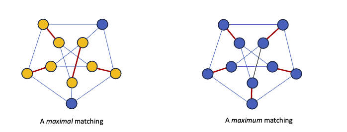
A maximum matching is the worst we could do as we would get the largest k, 
A minimal maximal matching will get us the lowest k
### Give an infinite family of example graphs on which the algorithm indeed outputs only a 2-approximate solution. Also give a family of example graphs on which the algorithm outputs an optimal solution.

**Star graph**
in a star graph we have to necessarily pick exactly one matching -, but with two vertices. min vertex cover is one, our output will always be 2

**Bipartite graphs**
given a bipartite graph, the matching will be the minimal nedeeded vertices for the vertex cover.

## Coloring 3-colorable graphs

### Given a 3-colorable n-vertex graph, show how you can in polynomial time find a proper $O(\sqrt{n})$-coloring of the graph
As input we get an $n$-vertex graph $G$ that we are promised to admit a proper 3-coloring. We want to find a proper $k$-coloring of $G$ in polynomial time in $n$ with as small a $k$ as possible

We know that since the graph is 3-colorable, every vertex neighborhood must be bipartite. We can color a bipartite graph fast by:

1. Pick a vertex with more than $\sqrt{n}$ uncolored neighbors.
2. Color all of them with 3 new colors
3. Repeat until there are no such vertices left
4. Greadily color the remaining vertices using $\sqrt{n}$ colors.

This all uses $O(\sqrt{n})$ colors.

We know the graph can be colored with 3 colors, 

## Metric problems and TSP
Lecture 26

### What does it mean that a graph has metric costs/weights?
They uphold the triangle inequality
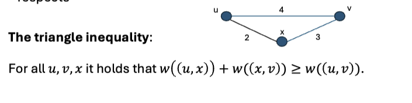
### What is the Steiner Tree problem?
The Steiner tree problem in graphs can be seen as a generalization of two other famous combinatorial optimization problems: the (non-negative) shortest path problem  and the minimum spanning tree problem

Given undirected graph 𝐺 = (𝑉, 𝐸) with edge weights 𝑤: 𝐸 → ℝ+, and a set of required vertices 𝑅 ⊆ V, find a a tree containing all vertices in 𝑅 of minimum total weight. You may use some or all of the non required vertices.
#### How can it be reduced to a version in which the input graph is required to have metric costs?
Steiner Tree reduces to Metric Steiner Tree
Given instance $I=(G,w,R)$ to Steiner tree, we construct an instance $I’=(G’,w’,R’)$ to Metric Steiner tree as follows:
1. We keep the same vertices in $I’$ as in $I$, but let $G’$ be the complete graph. 
2. We let $w(u,v)$ be equal to the length of the shortest path from $u$ to $v$ in G. 
3. We keep the same set of required vertices $R’=R$.

We then find the minimum spanning tree.
- We can compute the minimum spanning tree on the complete graph containing only the required vertices 𝑅 with weights equal to shortest path between vertices in original graph. Remember that the minimum spanning tree can be computed in polynomial time.

#### Give a 2-approximation for Metric Steiner Tree.
Minimum Spanning Tree is a 2-approximation of Metric Steiner Tree
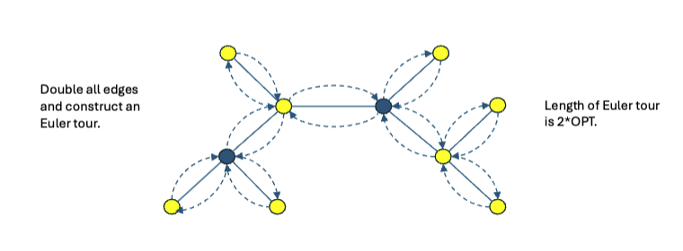

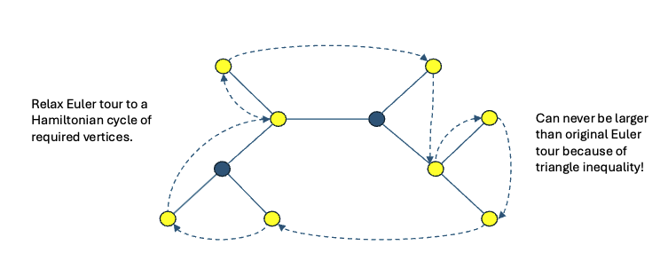
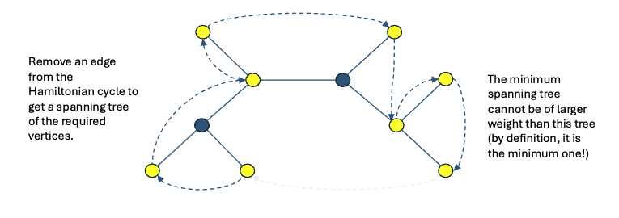
### Define the TSP and argue that it is NP-complete.
Given a complete undirected graph 𝐺 = (𝑉, 𝐸) with positive edge weights 𝑤: 𝐸 → ℝ+, find a tour visiting all vertices of minimum total weight.

hamiltonian cycle is NP-complete and we can reduce Hamiltonian to TSP by adding the same length weights to every edge. The return instance of TSP will be a hamiltonian cycle

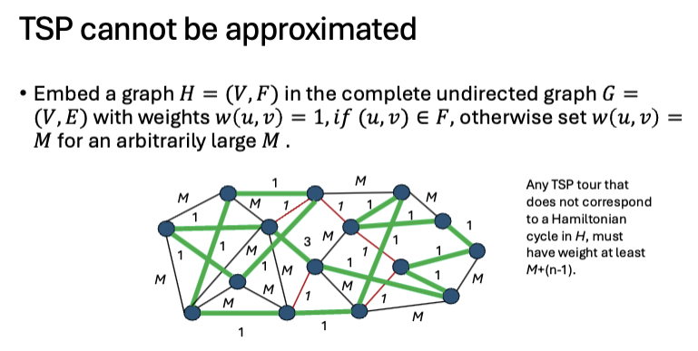

### Show that TSP remains NP-complete on metric instances.
Given a complete undirected graph 𝐺 = (𝑉, 𝐸) with positive edge weights 𝑤: 𝐸 → ℝ+, find a tour visiting all vertices of minimum total weight. The weights respect the triangle inequality.

**Reason**: Reduction from the Hamiltonian Cycle problem, where any approximate solution gives the exact solution.
- Suppose you could approximate TSP within a constant factor $c$
- Any approximate solution would distinguish between:
    - A valid Hamiltonian Cycle (cost $n$).
    - A non-Hamiltonian cycle (cost much greater than $c \cdot n$, because of large $M$).
- This would solve the Hamiltonian Cycle problem exactly, contradicting $P \neq NP$

### How do the general TSP and the metric TSP differ in terms of approximability? 

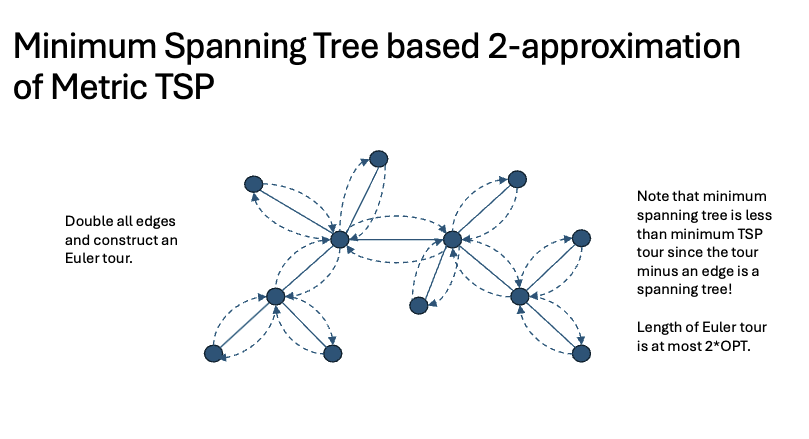
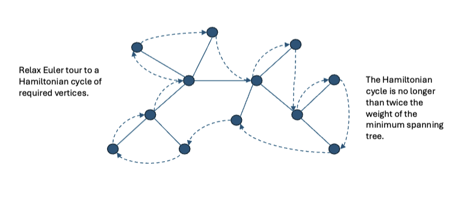
#### Argue that the general TSP cannot be approximated within a constant factor unless P=NP.
### Describe how to obtain a 2-approximation for the metric TSP. Highlight where you use the metric property.
When relaxing the euler tour we are doing so in triangles., this is how we use the property.
###  Describe how to obtain a (3/2)-approximation for the metric TSP

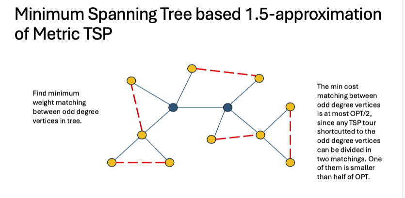
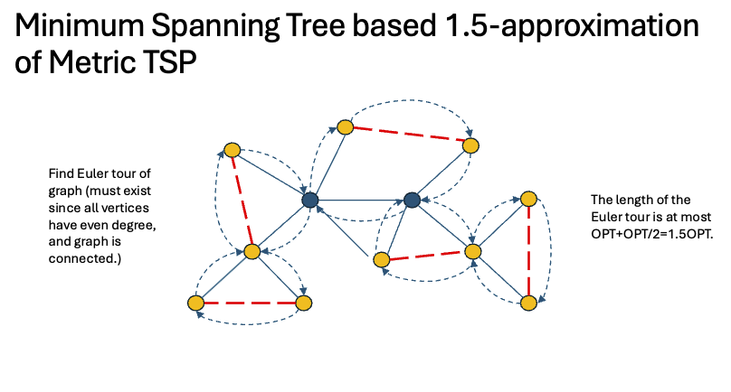
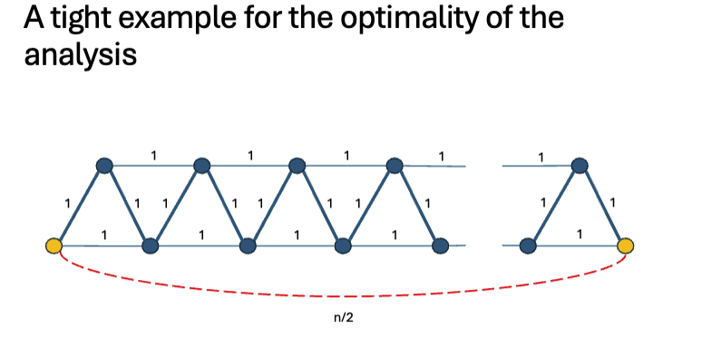
1. Compute an MST of the graph.
2. Find a **minimum-weight perfect matching** on the odd-degree vertices of the MST.
3. Combine the MST and the matching to form an Eulerian graph.
4. Find an **Eulerian circuit**, then convert it into a Hamiltonian cycle by skipping repeated visits.

- **Correctness**: Eulerian graph ensures a tour. Metric property guarantees skipping duplicates doesn’t increase the cost.
- **Approximation Ratio**:
    - MST cost $\leq \text{OPT}$
    - Matching cost $\leq \frac{1}{2} \times \text{OPT}.$
    - Total cost $\leq \frac{3}{2} \times \text{OPT}$
## Semidefinite Programming

### What is a semidefinite program? How fast can we find a solution to a semidefinite program in $n$ variables?

is a program, that takes a given input and computes it as vectors. It finds a plane that follows some min or max of a given function

Surprisingly, if we let the n vectors be unit vectors in n-dimensional Euclidean space, then there is a polynomial time algorithm! This is Goemans and Williamson’s algorithm

###  For a positive semidefinite matrix $M$, what is the name of the algorithm that computes a triangular matrix $L$ so that $LL^T=M$? What is its running time?
Cholesky factorization

If and only if $M$ is positive semidefinite, there exists a matrix $P$ such that $𝑀 = 𝑃𝑃^𝑇$. Such a $P$ given $M$ can then be found in polynomial time

Using Cholesky decomposition (see Section 26.7), a real symmetric matrix can be decomposed, in polynomial time, as $A=U ΛU T$, where $Λ$ is a diagonal matrix whose diagonal entries are the eigenvalues of $A$. Now $A$ is positive semidefinite iff all the entries of $Λ$ are nonnegative, thus giving a polynomial time test for positive semidefiniteness.
### Name two combinatorial problems that can be approximated with the help of semidefinite programming.
- **Max-Cut Problem**:
    - SDP provides a 0.878-approximation using the Goemans-Williamson algorithm.
- **3-Graph Coloring**:
    - SDP can approximate chromatic numbers or related variants
    - coloring is also just independent set problem
    - 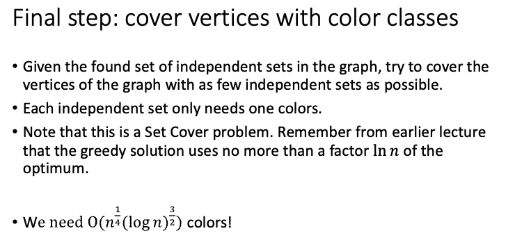
### How do you get from the vectors obtained from a solution to the semidefinite program to a solution to the combinatorial problem?
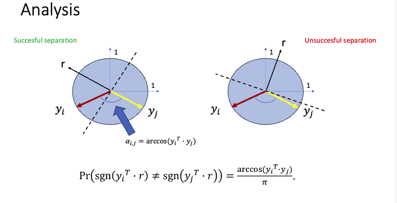